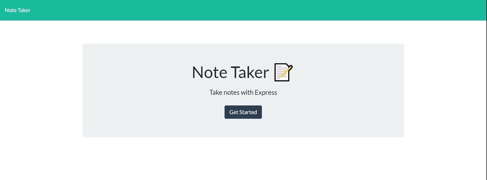
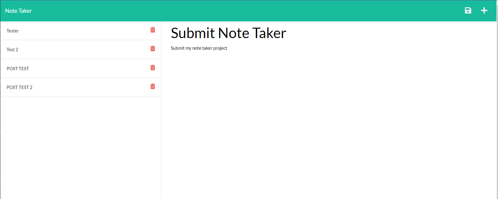

[](https://opensource.org/licenses/MIT)

# Note Taker App

## Description
This project uses Express.js and fs.js to read and write to files in order to keep notes. The App uses express api calls to get and post the information in a local database as well as fs to read and write that data

## Table of Contents
1. [Installation](#installation)
2. [Usage](#usage)
3. [Links](#links)
4. [Screenshots](#screenshots)
5. [License](#license)
6. [Questions](#questions)

## Installation
- Clone the repo down to your local machine
- Install modules by using `npm i` in your terminal
- Then youre good to move on to the usage

## Usage
- When installed, type `node server.js` in the terminal
- Navigate to http://localhost:3001
- - Alternatively, you can click on the app link [below](#links)
- Once the app has been launched, you can click any notes in the list to the left to see them
- the plus sign in the top right allows you to add a new note
- When the note is filled out a save icon will appear next to the plus sign

### User Story

```
AS A small business owner
I WANT to be able to write and save notes
SO THAT I can organize my thoughts and keep track of tasks I need to complete
```

### Acceptance Criteria

```
GIVEN a note-taking application
WHEN I open the Note Taker
THEN I am presented with a landing page with a link to a notes page
WHEN I click on the link to the notes page
THEN I am presented with a page with existing notes listed in the left-hand column, plus empty fields to enter a new note title and the note’s text in the right-hand column
WHEN I enter a new note title and the note’s text
THEN a Save icon appears in the navigation at the top of the page
WHEN I click on the Save icon
THEN the new note I have entered is saved and appears in the left-hand column with the other existing notes
WHEN I click on an existing note in the list in the left-hand column
THEN that note appears in the right-hand column
WHEN I click on the Write icon in the navigation at the top of the page
THEN I am presented with empty fields to enter a new note title and the note’s text in the right-hand column
```

## Links

[Dashboard Link](https://github.com/ThatBallinGuy/Note-Taker)

[App Link](https://note-taker.herokuapp.com/)

## Screenshots



## License
Licensed under [MIT License](https://opensource.org/licenses/MIT)

## Questions
For any questions, contact me at:
- Github: [ThatBallinGuy](https://github.com/ThatBallinGuy)
- Email: Tballin2000@hotmail.com
  